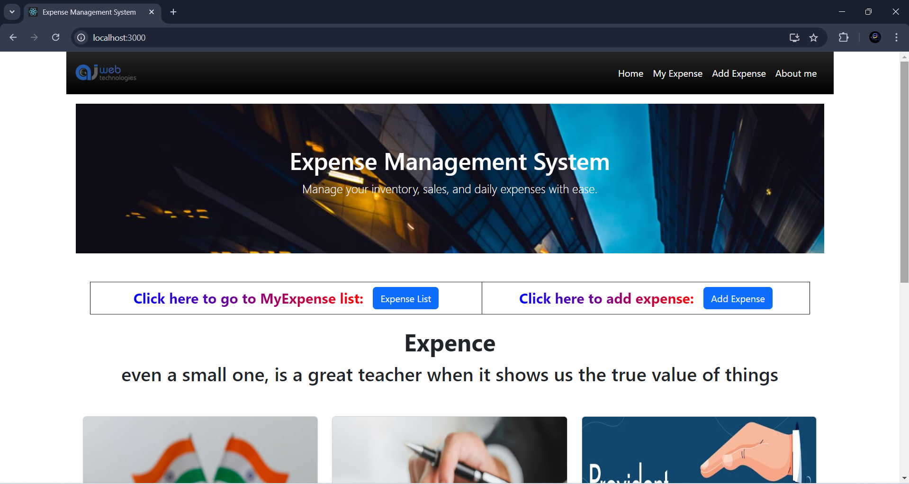
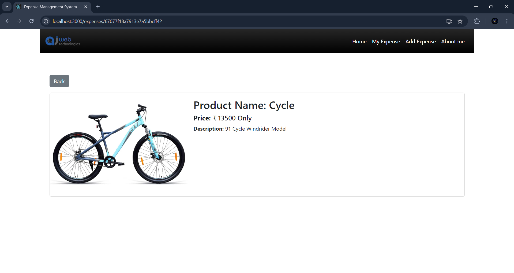

# Expense Management System







## Run Locally

Clone the project

```bash
  git clone https://github.com/ajscodes/Expense-Tracker-App
```

Go to the project directory

```bash
  cd Expense-Tracker-App
```

Go to the frontend directory and Install dependencies

```bash
  cd Frontend
```
```bash
  npm install
```

Go to the backend directory and Install dependencies

```bash
  cd Backend
```
```bash
  npm install
```

Start the frontend server

```bash
  npm start
```


Start the backend server

```bash
  nodemon index.js
```

## Environment Variables

To run this project, you will need to add the following environment variables to your .env file in backend folder

create config folder and add config.env file in it and all all env variables there.

`MONGO_URL` : Your MongoDB Connection String

`PORT`: PORT number


## Tech Stack

**Client:** React, react-bootstrap, Material Icons

**Server:** Node, Express

**Database:** MongoDB